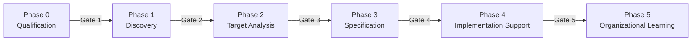

# ZAIA — AI Agent Team for Business-System Analysts

**Zespół Agentów AI wspierającego pracę Analityków Biznesowo-Systemowych**

A Claude Code skill that implements a multi-agent analytical framework for business-system analysts. ZAIA guides analysts through structured phases of discovery, process modeling, requirements engineering, domain analysis, integration mapping, and backlog generation — producing traceable, auditable artifacts at each step.

Based on the [ZAIA framework](https://www.liderzy.ai/zaia.html) by Liderzy.AI.

## What it does

When you describe an analytical task — qualifying an initiative, analyzing stakeholder interviews, modeling processes, writing requirements, or building a backlog — Claude activates the appropriate specialist agent role, follows the structured phase procedure, enforces quality gates, and produces actual files (Markdown, BPMN XML, Mermaid diagrams, CSV).

## 11 Specialist Agent Roles

| Role | Scope |
|------|-------|
| **Orchestrator** | Meta-coordinator, phase management, delegation |
| **Discovery** | Source analysis, stakeholder mapping, gap identification |
| **Process** | AS-IS/TO-BE BPMN modeling, exception flows, RACI |
| **Requirements** | Business/functional/system requirements, Given-When-Then stories |
| **Domain** | Glossaries, entity models, semantic consistency |
| **Integration** | System interfaces, data flows, API contracts |
| **NFR** | Non-functional requirements (security, performance, compliance) |
| **Risk & Compliance** | Risk registers, regulatory alignment, policy validation |
| **Backlog** | Epics, features, user stories, prioritization, dependencies |
| **Artifact Quality** | Cross-artifact validation, completeness, traceability |
| **Knowledge Repository** | Decision cataloging, pattern identification, lessons learned |

## 6 Phases with Quality Gates



Each gate has a checklist that must be confirmed before proceeding to the next phase.

## Output Structure

ZAIA produces files organized by phase:

```
<initiative-name>/
├── phase-0/          Initiative card, qualification assessment
├── phase-1/          Stakeholder map, AS-IS processes, discovery findings
├── phase-2/          TO-BE processes, domain model, integration catalog
├── phase-3/          Requirements, user stories, NFR catalog, traceability
├── phase-4/          Backlog, dependencies, sprint packages
├── phase-5/          Lessons learned, pattern catalog
└── governance/       Risk register, assumptions, decisions
```

Artifact formats: Markdown tables, BPMN 2.0 XML, Mermaid diagrams (flowcharts, ERD, mindmaps, sequence diagrams).

## Language Adaptation

ZAIA detects the analyst's language and produces all artifacts in that language. Works in Polish, English, and other languages.

## Installation

Copy the `zaia` directory to your Claude Code skills folder:

```bash
cp -r zaia ~/.claude/skills/
```

Or clone this repo:

```bash
git clone https://github.com/trampen/zaia-skill.git ~/.claude/skills/zaia
```

## Usage Examples

```
# Polish — initiative qualification + discovery
Mamy nową inicjatywę - wdrożenie systemu powiadomień dla klientów.
Zrób kwalifikację i rozpocznij discovery.

# English — TO-BE process design + requirements
Design a TO-BE automated onboarding process, create the domain model,
write functional requirements with user stories, and build a traceability matrix.

# English — backlog generation + risk assessment
Transform these requirements into a prioritized product backlog with epics,
user stories, dependencies, and acceptance criteria. Also do a risk assessment.
```

## Skill Structure

```
zaia/
├── SKILL.md              Main skill file (orchestrator logic, triggers)
├── references/
│   ├── agents.md         11 specialist agent role definitions
│   ├── phases.md         Phase procedures (0-5) with quality gates
│   └── artifacts.md      Artifact templates and formatting standards
└── evals/
    └── evals.json        Test scenarios for skill evaluation
```

## Evaluation Results

Tested on 3 scenarios (Polish + English, phases 0-4):

| Metric | With Skill | Baseline | Delta |
|--------|-----------|----------|-------|
| Pass Rate | 100% (18/18) | 56% (10/18) | **+44%** |
| Avg Time | 242s | 210s | +32s |
| Avg Tokens | 44k | 28k | +16k |

The skill's primary value is enforcing structure: phase-based organization, GWT story format, quality gate checklists, dedicated artifact files, and source traceability.

## License

MIT
