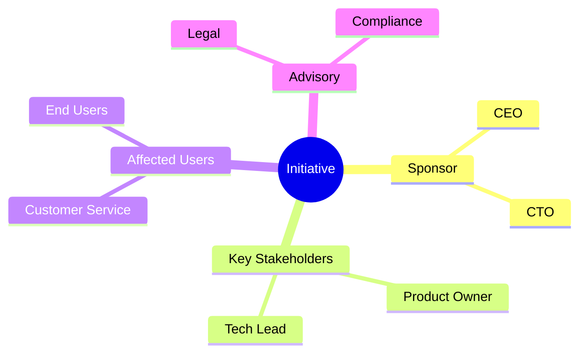
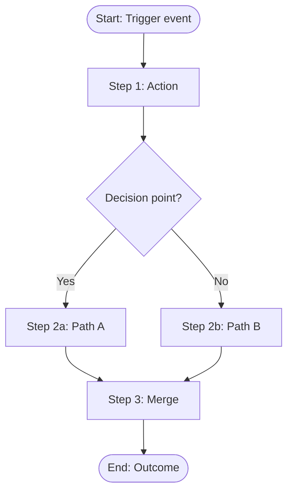
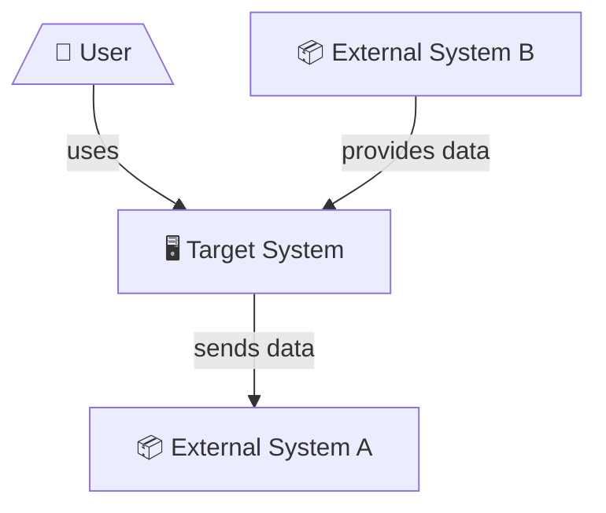
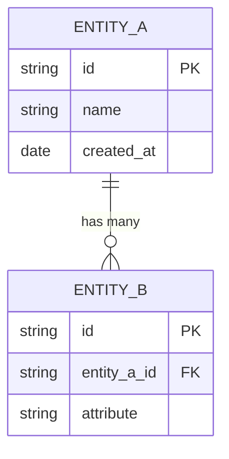
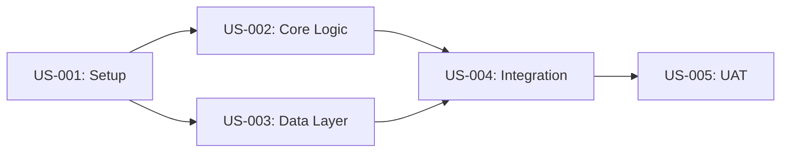

# ZAIA Artifact Templates & Standards

This reference provides templates and formatting standards for all artifact types produced by the ZAIA framework.

## Table of Contents

1. [Naming & Organization](#naming--organization)
2. [Strategic-Business Artifacts](#strategic-business-artifacts)
3. [Process Artifacts](#process-artifacts)
4. [Requirements Artifacts](#requirements-artifacts)
5. [Architecture-System Artifacts](#architecture-system-artifacts)
6. [Governance & Control Artifacts](#governance--control-artifacts)
7. [Implementation Artifacts](#implementation-artifacts)
8. [Mermaid Diagram Conventions](#mermaid-diagram-conventions)

---

## Naming & Organization

**File naming**: Use lowercase kebab-case: `stakeholder-map.md`, `as-is-process.bpmn`, `nfr-catalog.md`

**Directory structure**: Organize by phase. See SKILL.md for the full directory tree.

**Artifact header**: Every artifact file starts with a metadata block:
```markdown
# <Artifact Title>

**Initiative:** <initiative name>
**Phase:** <phase number and name>
**Version:** <version, e.g., 1.0, 1.1>
**Last updated:** <date>
**Author:** <analyst name> + ZAIA
**Status:** <Draft | Review | Approved>
```

**Source traceability**: When content is derived from a source, reference it inline:
```markdown
The current process requires dual approval for amounts exceeding 10,000 PLN [Source: Policy-2024-03, §4.2]
```

---

## Strategic-Business Artifacts

### Initiative Card
See template in `references/phases.md`, Phase 0 section.

### Problem Statement
```markdown
# Problem Statement: <Name>

## Current Situation
<What is happening now that's problematic>

## Impact
<Who is affected and how — quantify where possible>

## Root Cause (if known)
<Why this problem exists>

## Desired Outcome
<What success looks like>

## Constraints
<Budget, time, regulatory, technical, organizational limitations>
```

### Stakeholder Map

Combine a Mermaid diagram with a detailed table:

~~~markdown
# Stakeholder Map



| Stakeholder | Role | Interest | Influence | Engagement |
|-------------|------|----------|-----------|------------|
| <name> | <Sponsor/Key/Affected/Advisory> | <what they care about> | <High/Medium/Low> | <Inform/Consult/Collaborate/Empower> |
~~~

### Business Objectives & KPIs
```markdown
# Business Objectives

| ID | Objective | KPI | Current Baseline | Target | Timeline |
|----|-----------|-----|-----------------|--------|----------|
| OBJ-01 | <objective> | <measurable indicator> | <current value> | <target value> | <by when> |
```

---

## Process Artifacts

### BPMN 2.0 XML

Produce valid BPMN 2.0 XML with:
- `<bpmn:definitions>` root element with proper namespaces
- `<bpmn:collaboration>` with participants (swim lanes)
- `<bpmn:process>` for each participant
- Start/End events, tasks, gateways, sequence flows
- `<bpmndi:BPMNDiagram>` for layout (if feasible; if layout is complex, note that the XML is valid but auto-layout should be applied in a BPMN editor)

### Process Mermaid Visualization

Always provide a Mermaid version alongside BPMN XML:

~~~markdown
# <Process Name> — AS-IS / TO-BE



## Process Card

| Attribute | Value |
|-----------|-------|
| **Process name** | <name> |
| **Purpose** | <what this process achieves> |
| **Trigger** | <what starts it> |
| **Input** | <what enters the process> |
| **Output** | <what the process produces> |
| **Actors** | <who/what participates> |
| **Frequency** | <how often it runs> |
| **SLA** | <time constraints> |
| **Exceptions** | <known exception paths> |
~~~

### RACI Matrix
```markdown
# RACI Matrix: <Process Name>

| Activity | <Role 1> | <Role 2> | <Role 3> | <Role 4> |
|----------|----------|----------|----------|----------|
| <activity> | R | A | C | I |
```
R = Responsible, A = Accountable, C = Consulted, I = Informed

---

## Requirements Artifacts

### Business Requirements
```markdown
# Business Requirements

| ID | Requirement | Rationale | Priority | Source | Status |
|----|------------|-----------|----------|--------|--------|
| BR-01 | <what the business needs> | <why it matters> | <MoSCoW> | <source ref> | <Draft/Approved> |
```

### Functional Requirements
```markdown
# Functional Requirements

## <Capability Area>

| ID | Requirement | Related BR | Acceptance Criteria | Priority |
|----|------------|-----------|-------------------|----------|
| FR-01 | <what the system must do> | BR-01 | <testable condition> | <MoSCoW> |
```

### User Stories (Given-When-Then)
```markdown
# User Stories

## Epic: <Epic Name>

### US-001: <Story Title>

**As a** <actor>
**I want to** <action>
**So that** <business value>

#### Acceptance Criteria

**Scenario 1:** <scenario name>
- **Given** <precondition>
- **When** <trigger action>
- **Then** <expected outcome>

**Scenario 2:** <scenario name>
- **Given** <precondition>
- **When** <trigger action>
- **Then** <expected outcome>

**Priority:** Must Have
**Related Requirements:** FR-01, FR-02
**Dependencies:** US-003
```

### NFR Catalog
See template in `references/agents.md`, NFR Agent section.

### Business Rules
```markdown
# Business Rules

| ID | Rule | Type | Condition | Action | Source | Status |
|----|------|------|-----------|--------|--------|--------|
| BRL-01 | <rule name> | <Constraint/Derivation/Trigger> | <IF/WHEN condition> | <THEN action> | <source ref> | <Active/Proposed> |
```

### Traceability Matrix
```markdown
# Traceability Matrix

| Business Need | Business Req | Functional Req | User Story | Acceptance Criteria | Test Case |
|--------------|-------------|---------------|-----------|-------------------|-----------|
| <need> | BR-01 | FR-01, FR-02 | US-001 | AC-001 | TC-001 |
```

---

## Architecture-System Artifacts

### System Context Diagram (C4 Level 1)
~~~markdown
# System Context


~~~

### Integration Catalog
```markdown
# Integration Catalog

| ID | Source System | Target System | Interface | Protocol | Data Format | Frequency | Direction | SLA |
|----|-------------|--------------|-----------|----------|-------------|-----------|-----------|-----|
| INT-01 | <source> | <target> | <API/file/queue> | <REST/SOAP/SFTP/AMQP> | <JSON/XML/CSV> | <real-time/daily/on-demand> | <→/←/↔> | <response time> |
```

### Domain Model (ERD)
~~~markdown
# Domain Model


~~~

### Architecture Decision Record (ADR)
```markdown
# ADR-<NNN>: <Decision Title>

**Date:** <date>
**Status:** <Proposed | Accepted | Deprecated | Superseded>
**Context:** <What is the situation that requires a decision?>
**Decision:** <What was decided?>
**Rationale:** <Why was this option chosen?>
**Alternatives considered:**
1. <Alternative 1> — rejected because <reason>
2. <Alternative 2> — rejected because <reason>
**Consequences:** <What follows from this decision?>
```

---

## Governance & Control Artifacts

### Risk Register
```markdown
# Risk Register

| ID | Risk | Category | Likelihood | Impact | Score | Mitigation | Owner | Status |
|----|------|----------|-----------|--------|-------|-----------|-------|--------|
| RSK-01 | <description> | <Regulatory/Operational/Project/Technical/Security> | <1-5> | <1-5> | <L×I> | <mitigation strategy> | <who> | <Open/Mitigated/Accepted/Closed> |
```

### Assumption Log
```markdown
# Assumption Log

| ID | Assumption | Basis | Impact if Wrong | Validation Plan | Status |
|----|-----------|-------|----------------|----------------|--------|
| ASM-01 | <what we assume> | <why we assume it> | <what happens if it's wrong> | <how to validate> | <Open/Validated/Invalid> |
```

### Decision Register
```markdown
# Decision Register

| ID | Date | Decision | Context | Rationale | Decided By | Impact |
|----|------|---------|---------|-----------|-----------|--------|
| DEC-01 | <date> | <what was decided> | <why it came up> | <why this option> | <who> | <what it affects> |
```

---

## Implementation Artifacts

### Backlog Structure
```markdown
# Product Backlog

## Epic: <Epic Name>
<Description and success criteria>

### Feature: <Feature Name>
<Description>

#### Stories:
- [ ] US-001: <title> [Must Have] — depends on: none
- [ ] US-002: <title> [Must Have] — depends on: US-001
- [ ] US-003: <title> [Should Have] — depends on: US-001
```

### Dependency Graph
~~~markdown
# Story Dependencies


~~~

### Change Impact Analysis
```markdown
# Change Impact Analysis: <Change Description>

**Requested by:** <who>
**Date:** <date>

## Change Description
<What changed or what is requested>

## Impact Assessment

| Artifact | Impact | Details |
|----------|--------|---------|
| <artifact name> | <None/Low/Medium/High> | <what needs to change> |

## Affected Requirements
- FR-01: <how it's affected>

## Affected Stories
- US-001: <how it's affected>

## Effort Estimate
<Relative size of the change>

## Recommendation
<Accept/Reject/Defer with rationale>
```

---

## Mermaid Diagram Conventions

Apply these conventions across all Mermaid diagrams:

- **Flowcharts**: Use `graph TD` (top-down) for processes with clear sequential flow, `graph LR` (left-right) for timelines and dependencies
- **Subgraphs**: Use subgraphs to group related elements (e.g., swim lanes in process diagrams)
- **Node shapes**: `([...])` for start/end events, `{...}` for decisions, `[...]` for tasks, `[/".../"\]` for actors
- **Edge labels**: Always label edges that represent conditions or data flow
- **Color**: Use `style` or `classDef` sparingly for emphasis (e.g., highlighting gaps or risks)
- **Size**: Keep diagrams readable — if a process has more than 15-20 nodes, split into sub-process diagrams with links between them
